# CourseModel
Слепцов Дмитрий Евгеньевич.
Тел: 89969522598.
Телеграм: @DsL86

Микросервисное приложение, реализующее REST-API с CRUD-сервисами.

Реализован Web-интерфейс с возможностью:
1) Добавление курсов учебного заведения.
2) Добавление, удаление и запись на курсы студентов.
3) Добавление, удаление и найм профессоров на курсы.
4) Выставление оценок профессором.
5) Отображение у студента курсов, на которые он записан, а так же оценки и средний балл по каждому курсу.
6) Отображение у профессора общего количества студентов по всем курсам и среднего балла всех студентов.

Использована БД H2, чтобы упростить работу с приложением проверяющему.
Дополнительно создавать БД не нужно.

РУКОВОДСТВО ПО РАБОТЕ С ПРИЛОЖЕНИЕМ.

Запустите приложение в любой удобной для Вас IDE.
Адрес главной страницы http://localhost:8080/main

Далее необходимо добавить студентов, курсы и профессоров:
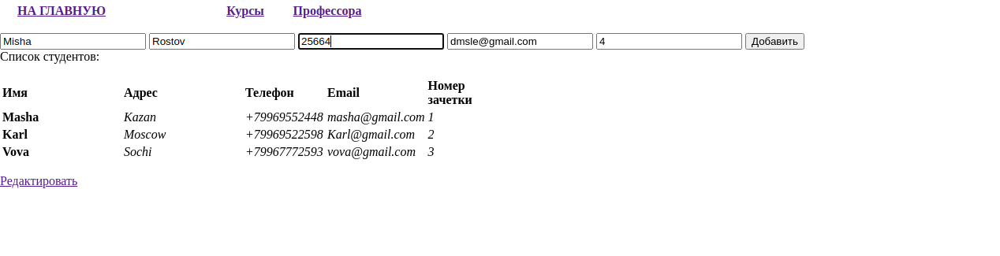
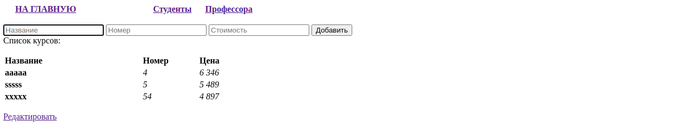
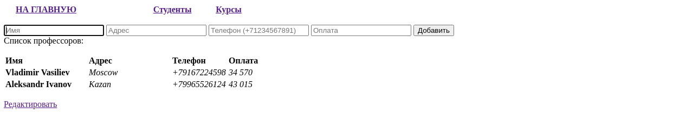

Предусмотрена проверка на валидность телефонного номера (в формате +79876543211), валидность электронной почты, только 
положительный номер зачетки, а так же заполненность всех полей.

Добавить на курс студентов. Это можно сделать из вкладки "Студенты" или из вкладки "Курсы" по ссылке "Редактировать".
Там же можно удалить студентов с курса:
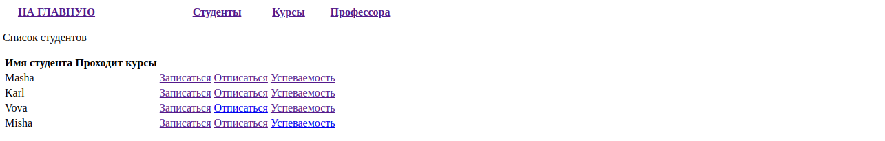
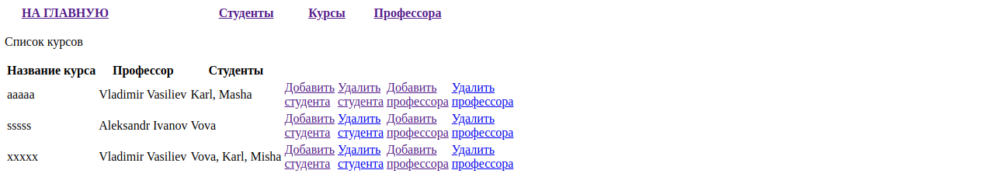
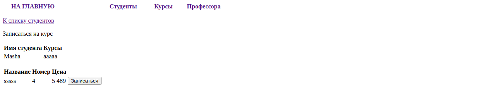

Добавить или удалить профессоров на курс так же можно из вкладки "Курсы", либо из вкладки "Профессора" по ссылке "Редактировать":
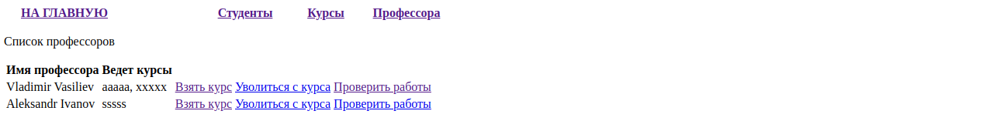
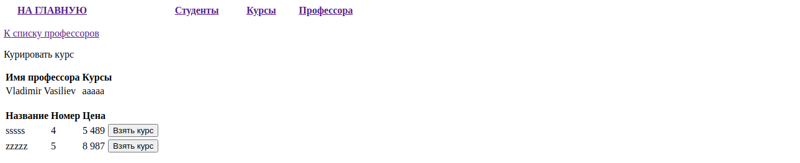
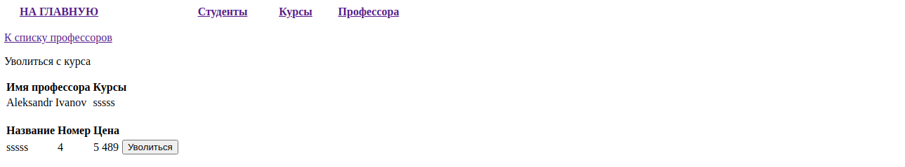

Там же профессор может проверить работы студентов на своих курсах, посмотреть общее количество студентов на всех курсах, 
среднюю успеваемость по всем курсам и выгрузить эту информацию в файл xlsx:
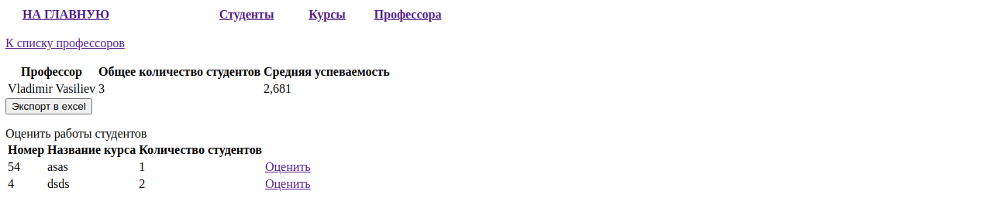
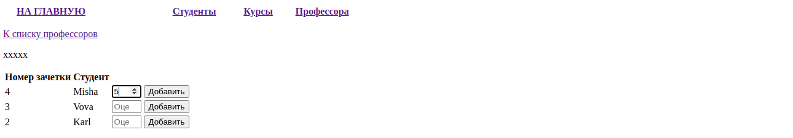

Возможность выставления оценки в интервале от 1 до 5.

Во вкладке "Студенты" выбрав необходимого студента можно посмотреть его оценки, средний балл и финальную оценку по 
каждому курсу:
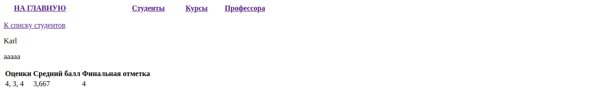

